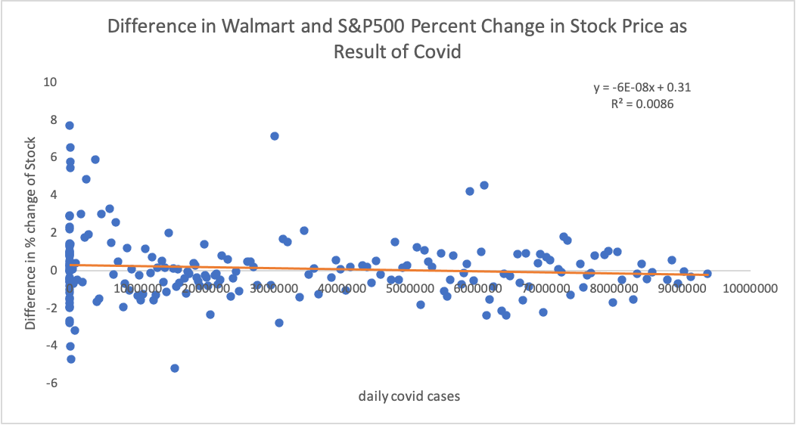
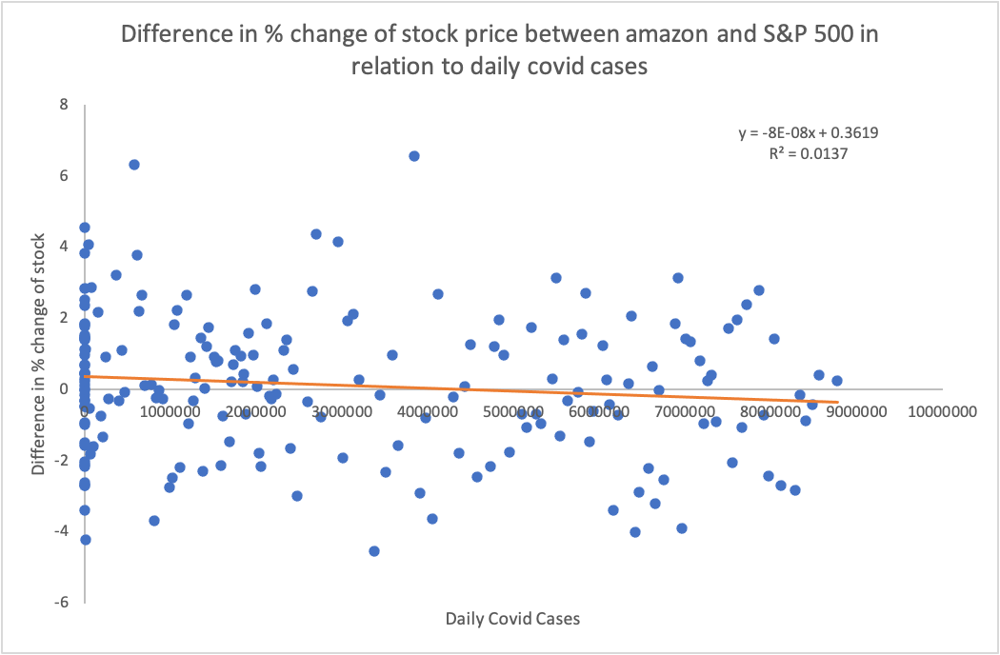
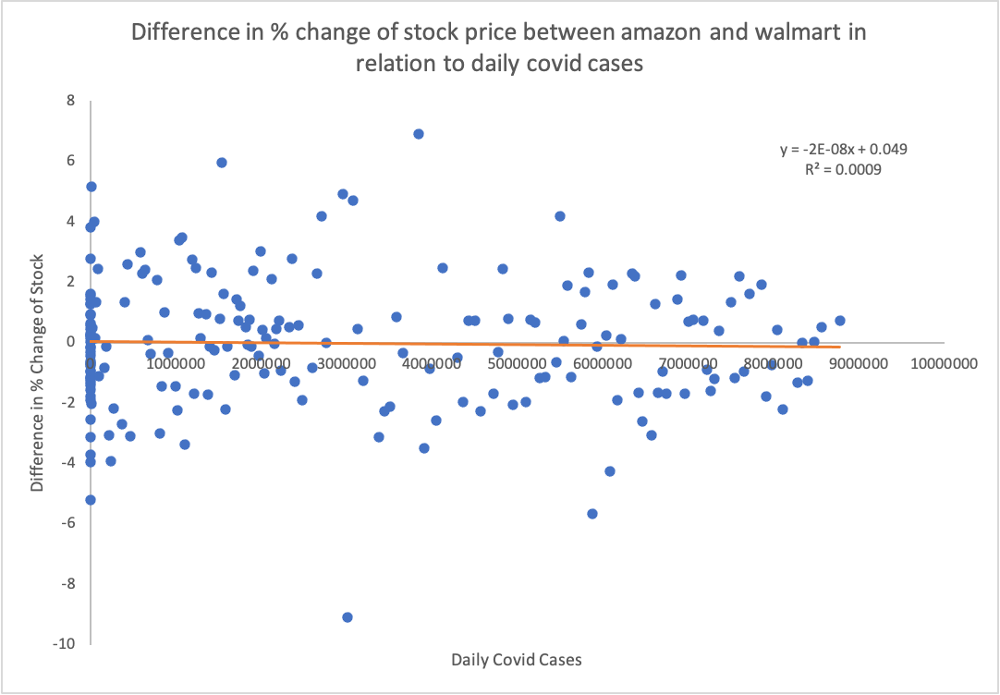
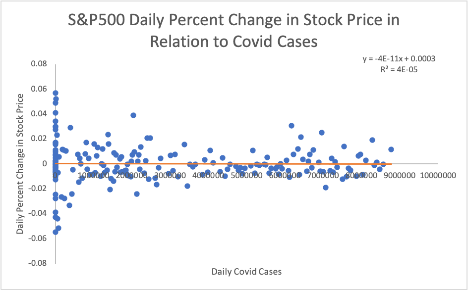
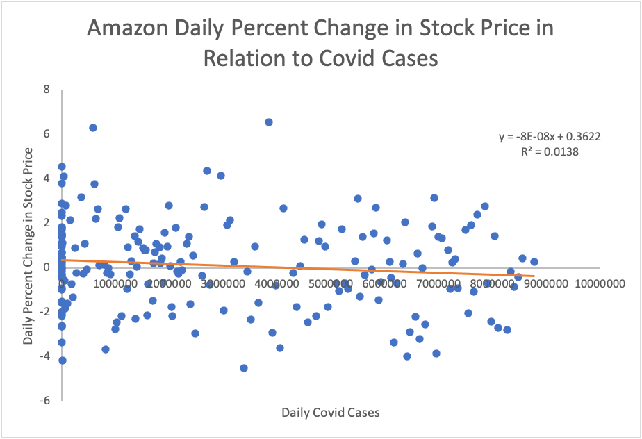
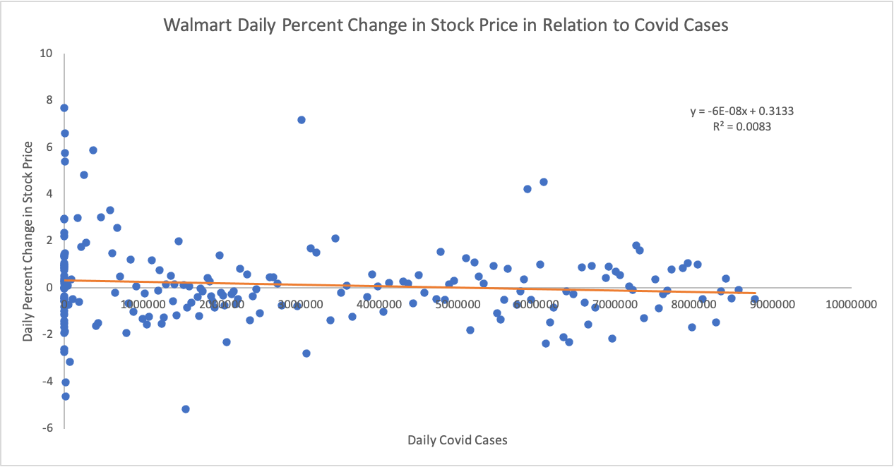

# Finance Big Data

For this project we used different Big Data tools including Hadoop Map Reduce, HiveSQL, and Spark to process and analyse data for amazon stock, walmart stock, SP500, and Covid-19

## SP500 (Mateo)

### Description

This folder contains the ingestion and running of the SP500 dataset

### Data Ingestion

The data ingestion folder contains a PDF with the isntruction on how the data was ingested first by downloading it from Yahoo and then transfering it to HDFS

### Data Cleaning and Profiling

In order to clean and profile the data a map Reduce job was done. It is contained under the folder Map Reduce Cleaning and Profiling. In this job we calculated the SP500 daily price fluctuation and daily price change.

### Screenshots

The screenshots folder contains screenshots of the Map Reduce Job running.

### Running MapReduce in Dumbo

hadoop jar clean.jar Clean /user/mr5246/FinanceProject/SP500.csv /user/mr5246/FinanceProject/newOutput/cleanSP500


## Spark MlLib (Mateo)

### Description

The spark folder contains a machine learning job written in Scala using Spark MlLib.
The functionality of this job is to use machine learning to try and see to what extent amazon stock's price is predictable by Walmart Stock Price, SP500, and Covid data.

### Machine Learning Algorithms

The Scala job runs three different Classification Machine Learning algorithms: Naive Bayes, Logistic Regression, and Random Forest.

### Labels and Feutures

Label:
Amazon's stocks price daily change. 0 - Negative change. 1 - Positive change.
Features:
1. Amazon Stock's price daily fluctuation
2. Walmart's stocks price positive daily change
3. Walmart's stocks price negative daily change
4. Covid daily cases count
5. Covid daily deaths count
6. SP500's price positive daily change
7. SP500's price negative daily change
8. SP500's price daily fluctuation

### Training Models and Testing

All three machine learning models are trained and tested for their accuracy a total of 10 times using different seeds to separate the training 75% and testing data 25%.
Each model has a corresponding array holding the accuracy results for each run as well as a sum variable to later calculate the average.

### Input and output

The job takes as input the file data.txt which is in csv format and from it generates a  RDD containing a collection of LabeledPoints. It then outputs the average accuracy for each model and accuracy results for each run to output.txt.

### Running the program

This Spark job can very easily be run locally by using an IDE like IntelliJ and sbt as the build tool.

### Screenshots

The screenshots folder contians screenshots from the output and from the program running

## Covid (Marcus)

My code analyses how covid cases/deaths relate to S&P 500 trading data over the pandemic

The code has 4 different mappers that have to be run separately with the reducer to produce 4 different outputs.

1. COVID cases vs S&P 500 change
2. COVID deaths vs S&P 500 change
3. COVID cases vs S&P 500 fluctuation
4. COVID deaths vs S&P 500 fluctuation

 The input data is in covid-vs-sp500 folder, a file called `all.csv`. The outputs of the mapreduce pairs should be fed in to 
 plotter.py to generate plots that illustrate the relationships. 

#### File Structure

covid
├── data-processing
   ├── clean                   # MapReduce job that cleans `us-covid.csv` to `covid-data-clean.csv`
   ├── count                   # Counts the number of rows in an arbitrary input file
   ├── total-cases             # Counts the number of covid cases in US, input file - `covid-data-clean.csv`
   ├── total-daily             # Transforms `covid-data-clean.csv` to total daily data 
   └── weekly-cases            # Transforms clean covid data to weekly covid data, input file - `covid-data-clean.csv`
|   
├── analysis                   # Counts the number of covid cases in US, input file - `covid-data-clean.csv`
   ├── mapreduce               # 4 mappers and 1 reducer, 4 different jobs, produce separate output for each, input file - `all.csv`
   └── plotter.py              # Output of each mapreduce jobs for `mapreduce` should be fed in plotter to create a chart

#### Running the program
For analysis, run each mapper with the reducer separately and input the output stream to plotter.py to get the chart.
For data processing, check the file structure comments

 
## Amazon and Government Restrictions (Lockdown) (Kate)

**Description**

This code works to compare the two Amazon and Walmart datasets with government lockdown data on Covid. The government lockdown data is from the organization ACAPS and the other two datasets were mentioned previously. This code cleans the Amazon data (AMZNDataCleaning), and cleans and analyzses the lockdown data and reformats Holly's Walmart data to match the Hive table formatting I used (formatWMT). Then, these are subsequently analyzed as shown. It also includes covid data as an additional measure. 

**Running the Program**

Extensive screenshots are provided which detail how the code is run, as well as documment some of the progress in writing the code. Everything is accomplished through the use of Hive and MapReduce, and no external methods (other than Hadoop) are used, as is documented. 

**Features**

1. ACAPS (lockdown) data vs. AMZN stock
2. ACAPS (lockdown) data + Covid data vs. AMZN stock
3. ACAPS (lockdown) data vs. WMT stock
4. ACAPS (lockdown) data + Covid data vs. WMT stock
5. ACAPS (lockdown) data vs. Covid data 
6. ACAPS (lockdown) data

This is a large dataset of all of the government restrictions (and rollbacks of said restrictions) imposed by (nearly) every country in the world. Our analysis selects for only those which affect the US and the assisgns a "restriction" score to each date, which is the total number of restrictions implemented by the US government on that day subtracted by the number of restrictions rolled back on that day. This aims to get a measure of the degree to which each day represented a rollback of measures (such as lockdown measures or mask mandates) or the implemenataion of them.

## Hive (Holly)
**Objective:**
<p>
This file describe the step-by-step commandline issues to use hive to combine different datasets and calculating indexs that we designed using various fields in various datasets.

We are using datasets from the clean_data_source folder which contains 4 csv files, with daily stock prices from three stocks (Amazon, Walmart, and S&P 500)and daily cases all marked by dates. Previously, we have cleaned up the stock prices using MapReduce (code attatched in the folder hive/DataCleaning/clean) to calculate the percentage change and percentage fluctuation from day to day. The purpose of this project is to combine the tables by dates (discarding the dates that the datasets do not have in common), and look at the relation between covid cases (as independent variables) and change in stock price of each companies (dependent variables) as well as comparing stock price change between companies as a result of covid.

For the comparison between stocks, we are looking at Amazon and Walmart separately using S&P 500 as a baseline for the general economic performance during covid, and we are also comparing Amazon and Walmart to see the differences between how they perform under the influence of covid.

**Step 1. Setup codes:**
```
beeline
!connect jdbc:hive2://babar.es.its.nyu.edu:10000/
use sc6220;
```

**Step 2. put file into hdfs**
```
hdfs dfs -mkdir /user/sc6220/hiveInput/amazon
hdfs dfs -mkdir /user/sc6220/hiveInput/walmart
hdfs dfs -mkdir /user/sc6220/hiveInput/covid
hdfs dfs -mkdir /user/sc6220/hiveInput/sp500

hdfs dfs -put amazon.csv hiveInput/amazon
hdfs dfs -put walmart.csv hiveInput/walmart
hdfs dfs -put cases-daily.csv hiveInput/covid
hdfs dfs -put cleanSP500.csv hiveInput/sp500
```
**Step 3. create hive tables**
```
create external table walmart(wdate date, wopen float, whigh float, wlow float, wclose float, wpc float, wpflux float, wvolumn int) row format delimited fields terminated by ',' location '/user/sc6220/hiveInput/walmart';

create external table amazon(adate date, aopen float, ahigh float, alow float, aclose float, apc float, apflux float, avolumn bigint) row format delimited fields terminated by ',' location '/user/sc6220/hiveInput/amazon';

create external table sp(sdate date, sclose float, shigh float, sopen float, svolumn bigint, slow float,  spc float, spflux float) row format delimited fields terminated by ',' location '/user/sc6220/hiveInput/sp500';

create external table covid(cdate date, infected int, death int) row format delimited fields terminated by ',' location '/user/sc6220/hiveInput/covid';
```

*issues:*
* hive seems to only accept date in the format of yyyy-mm-dd
* some of the volumn of stock (amazon and sp500)'s data type needed to be changed from int to bigint, otherwise showing up as NULL

**Step 4. join tables:**

(1) awc: amazon + walmart + covid //Amazon and Walmart (separately) contrast to S&P 500 (as baseline) as an effect of covid
```
create table awc as select amazon.*,walmart.*,covid.* from amazon join walmart on (amazon.adate = walmart.wdate) join covid on (walmart.wdate = covid.cdate);
```
(2) wsc: walmart + sp500 + covid //covid's influence on walmart with sp500 as economic backdrop baseline
```
create table wsc as select walmart.*,sp.*,covid.* from walmart join sp on (walmart.wdate = sp.sdate) join covid on (sp.sdate = covid.cdate);
```
(3) asc: amazon + sp500 + covid //covid's influence on amazon with sp500 as economic backdrop baseline
```
create table asc as select amazon.*,sp.*,covid.* from amazon join sp on (amazon.adate = sp.sdate) join covid on (sp.sdate = covid.cdate);
```
*issues:*
* duplicate date field, even though I am doing inner join by date, the date of each table is still a separate field -> solution: add a table prefix to all variables (e.g.: wdate, adate...) as shown in code above
* it took me a while to figure out the aliasing and variable use for joining multiple tables in one go, I decided against aliasing eventually because I wanted to make variables straightforward to understand
*notes:*
* creating table from cvs file is fast on hive but joining table takes a long time
* a lot of covid cases show up as consecutive all 0 towards the beginning of 2020

**Step 5. Create new result tables with calculated independent and dependent variable pairs we are looking at**
Compare difference of percentage stock price change:

(1) rawc: {%change amazon - %change walmart, covid infection}
```
create table rawc as select infected, (apc - wpc) as diff_pc from awc;
```
(2) rwsc: {%change walmart - % change sp500, covid infection}
```
create table rwsc as select infected, (wpc - spc) as diff_pc from wsc;
```
(3) rasc: {%change amazon - %change sp500, covid infection}
```
create table rasc as select infected, (apc - spc) as diff_pc from asc;
```

Compare individual stock price change:
(4) ac: {%change amazon, covid infections}
```
create table ac as select infected, apc as pchange from awc;
```
(5) wc: {%change walmart, covid infections}
```
create table wc as select infected, wpc as pchange from awc;
```
(6) sc: {%change s&p500, covid infections}
```
create table sc as select infected, spc as pchange from asc;
```


**Step 6. Export hive table to hdfs and then local filesystem as csv**
in beeline:
```
insert overwrite directory '/user/sc6220/output/awc' row format delimited fields terminated by ',' lines terminated by "\n" select * from rawc;
insert overwrite directory '/user/sc6220/output/wsc' row format delimited fields terminated by ',' lines terminated by "\n" select * from rwsc;
insert overwrite directory '/user/sc6220/output/asc' row format delimited fields terminated by ',' lines terminated by "\n" select * from rasc;

insert overwrite directory '/user/sc6220/output/ac' row format delimited fields terminated by ',' lines terminated by "\n" select * from ac;
insert overwrite directory '/user/sc6220/output/wc' row format delimited fields terminated by ',' lines terminated by "\n" select * from wc;
insert overwrite directory '/user/sc6220/output/sc' row format delimited fields terminated by ',' lines terminated by "\n" select * from sc;
```
in hadoop (rename file)
```
hadoop fs -mv /user/sc6220/output/awc/000000_0 /user/sc6220/output/awc/awc.csv
hadoop fs -mv /user/sc6220/output/asc/000000_0 /user/sc6220/output/asc/asc.csv
hadoop fs -mv /user/sc6220/output/wsc/000000_0 /user/sc6220/output/wsc/wsc.csv

hadoop fs -mv /user/sc6220/output/ac/000000_0 /user/sc6220/output/ac/ac.csv
hadoop fs -mv /user/sc6220/output/wc/000000_0 /user/sc6220/output/wc/wc.csv
hadoop fs -mv /user/sc6220/output/sc/000000_0 /user/sc6220/output/sc/sc.csv
```

create a new directory in dumbo to store result from hdfs:
```
hdfs dfs -get /user/sc6220/output/awc/awc.csv
hdfs dfs -get /user/sc6220/output/asc/asc.csv
hdfs dfs -get /user/sc6220/output/wsc/wsc.csv

hdfs dfs -get /user/sc6220/output/ac/ac.csv
hdfs dfs -get /user/sc6220/output/wc/wc.csv
hdfs dfs -get /user/sc6220/output/sc/sc.csv
```


**Step 7. Room to explore:**
1. look further into past for more baseline economic performance without covid
2. predict stocks in relation to covid deaths instead of infected cases
3. use more advanced machine learning methods to train model


**Additional Code**
for combining all data needed for analysis into the same csv file
```
create table all as select amazon.*,walmart.*,covid.*,sp.* from amazon join walmart on (amazon.adate = walmart.wdate) join covid on (walmart.wdate = covid.cdate) join sp on (covid.cdate = sp.sdate);

insert overwrite directory '/user/sc6220/output/all' row format delimited fields terminated by ',' lines terminated by "\n" select adate,apflux, apc,wpflux,wpc,spflux,spc,infected,death from all;

hadoop fs -mv /user/sc6220/output/all/000000_0 /user/sc6220/output/all/all.csv

hdfs dfs -get /user/sc6220/output/all/all.csv
```

## Conclusion and Analysis: ##






<p>The scatter plots show that all three stocks are fluctuant due to other factors that impact stock price besides covid, however we see that both amazon and walmart display a downward sloping trend as the number of covid cases rises, while S&P 500 stay mostly unaffected. Amazon stock goes down slightly more than walmart stock due to covid, perhaps due to the fact that Walmart sells daily essentials while more of Amazon's business is comprised of luxury goods. An assumption can be made and further explored that in terms of grocery purchasing, people still favor in-person stock Walmart to Amazon's delivery service although there is a high risk of catching the virus, perhaps due to people's need to get out of the house during the quarentine.
</p>
